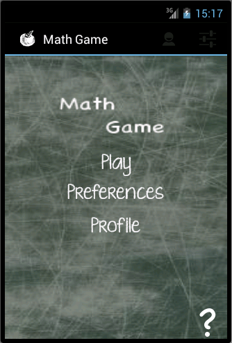
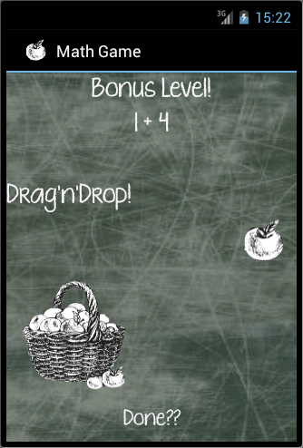

Android--Math-Game
==================

Mobile Applications Assignment 2: Math Game

This Android App has been designed to be a Maths Game for children. The app ‘thinks’ of two numbers to add/subtract and the child must enter the answer.

Features and Components included:

- A scoring system that shows how many right and wrong answers the user got
- 3 Difficulties: Beginner/Intermediate/
- Experience Points and a User Skill Level
- Notification Manager to notify them when they have achieved a highscore
- Data Persistence: User Info is stored locally in a database
- Bonus Interactive Question: User has to drag an apple into a basket a number of times to answer a question

Here the User must drag the apple into the basket X number of times, where X is equal to the answer to the question.

 

More screenshots can be found here: [Screen Shots](Asn2ScreenShots/)
